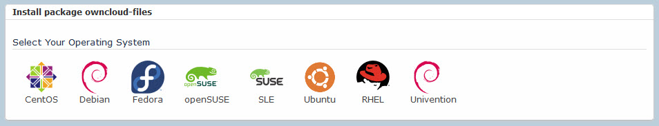

# **ownCloud 10.0.7 Quickstart Guide -- Installing and Connecting**

This Quickstart Guide provides you with setup and use instructions for
ownCloud 10.0.7, providing links to other Web pages for more details.

## What is ownCloud?

ownCloud is a free, open-source, suite of client--server software for creating and using file hosting services. The ownCloud server runs
on most popular Linux distributions. You can connect to the server using the desktop client running on Windows, MacOS or Linux, or the ownCloud
mobile app running on iOS or Android devices.

ownCloud is the last cloud collaboration/file sharing/file synching/data
privacy platform you will ever need.

#### [What's New in ownCloud 10.0.7.](https://doc.owncloud.org/server/latest/admin_manual/whats_new_admin.html)

## Overview

This Quickstart Guide provides information and links for several of the most commonly used tasks when you are starting with ownCloud:

-   Install and configure the ownCloud server

-   Configure the ownCloud server IP address and port

-   Add a user account

-   Connect to the ownCloud server from a desktop or mobile client

___

___

### **Task:** Install and configure the ownCloud server

**Role:** Administrator

1.  Open the [download page](https://owncloud.org/download/).

2.  Choose 1 of the following download options:

    a.  Tarball

        -   Most common option

        -   Best for production environments

        -   Intended for experienced administrators

        -   The most customizable installation method

    b.  Docker image

        -   ownCloud maintains an *ownCloud Server Docker Image*

        -   Intended for experienced administrators

        -   For a **docker-compose.yml** example, go to [github](https://github.com/owncloud-docker/server)

    c.  Appliance

        -   Easiest way to get ownCloud up and running - built on Ubuntu Linux and is fully set up and configured with a secure
            connection and the ownCloud Proxy app.

        -   Best approach for non-technical users

        -   Image formats provided for several hosting environments: ESX, VMware, VirtualBox, KVM
        

    d.  Linux distribution packages: ready-to-deploy packages for popular Linux distributions such as Debian, Ubuntu, Fedora,
        RedHat Enterprise Linux, CentOS and openSUSE.
        

    e.  Web Installer: Installs ownCloud on a web space. It checks the dependencies, downloads ownCloud from the official server,
        unpacks it with the right permissions and the right user account. Finally, you will be redirected to the ownCloud
        installer.

3.  Follow the installation instructions in the [Administration 
    Guide](https://doc.owncloud.org/server/latest/admin_manual/installation/).

___

### **Task:** Configure the ownCloud server IP address and port

**Role:** Administrator

The ownCloud server is serviced by the webserver you chose. You must edit the configuration for the webserver to change IP address or port.
Follow [these steps](https://central.owncloud.org/t/how-to-change-the-port-owncloud-is-using/834)
for Apache and Nginx.

___

### **Task:** Add a user account

**Role:** Administrator

To create a new user from the UI, follow [these
steps](https://doc.owncloud.org/server/latest/admin_manual/configuration/user/user_configuration.html#creating-a-new-user).

To create a new user from the command line (with the **occ** command),
follow [these
steps](https://doc.owncloud.org/server/10.0/admin_manual/configuration/server/occ_command.html#user-commands).

___

### **Task:** Connect to the ownCloud server from a desktop or mobile client

**Role:** User

To connect to the ownCloud server, use a Web browser or your mobile device.

When you install the ownCloud app and open it you are prompted for your ownCloud server URL and login.

#### Using the desktop client:

Use any Web browser, such as, Firefox 14+, Chrome 18+, Safari 5+, or IE11+ (except Compatibility Mode).

Point your Web browser to your ownCloud server:

-   URL: https://*example.host.com*/owncloud:*8080*

-   Log in with your user name and password

#### Using the Android app:

-   Download the ownCloud app.

-   Run your ownCloud Android app, it opens to a configuration screen.

-   Enter your server URL, login name, password, and click the **Connect** button.

#### Using the iOS app:

-   Download the ownCloud app.

-   Open any Web browser, such as Safari, and point it to your ownCloud server.

-   Log in and look on your Personal page for a link to the ownCloud app on iTunes.

